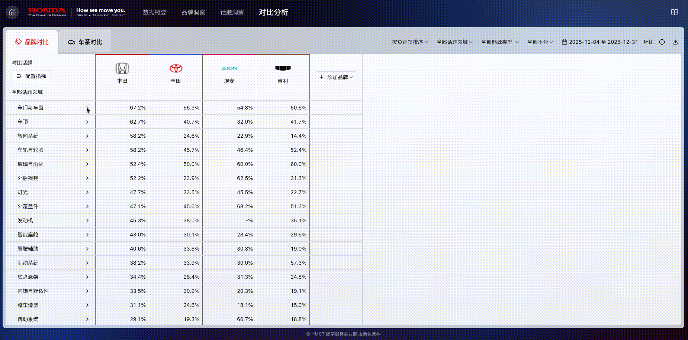

# CHINA CUSTOMER VOICE. 用户手册

## 核心模块

* **数据概要**：快速了解品牌整体表现及热点话题分布
* **品牌洞察**：从多维度分析品牌与车系的口碑表现
* **话题洞察**：基于话题视角识别用户关注点与情绪变化趋势
* **对比分析**：按业务需求进行多维度横向对比分析
* **用户手册**：查看产品功能说明与使用指引

<figure><figcaption></figcaption></figure>

***

## 数据概要

### 使用场景

用于快速了解各品牌的核心数据表现，并查看整体话题的讨论趋势，帮助用户在短时间内掌握品牌声量与舆情概况。

### 功能说明

#### **时间范围筛选**

*   支持自由选择分析数据的日期范围。

    <figure><figcaption></figcaption></figure>
*   支持设置对比时段，用于进行环比、同比、自定义对比分析。

    <figure><figcaption></figcaption></figure>

#### **好评 / 差评排行榜切换**

支持在「好评榜」与「差评榜」之间切换，快速查看品牌在不同情绪维度下的表现情况。

<figure><figcaption></figcaption></figure>

#### **品牌切换**

点击品牌图标即可切换当前分析品牌，联动更新下方的热门话题、趋势话题及话题领域榜数据。

<figure><figcaption></figcaption></figure>

#### **热门话题**

展示当前讨论热度最高的话题内容，支持按**好评量或负评量**进行排序查看。

<figure><figcaption></figcaption></figure>

#### **趋势话题**

展示近期讨论量增长较快的话题，支持按**好评量增长率或负评量增长率**排序。

<figure><figcaption></figcaption></figure>

#### **话题领域榜**

展示各细分领域中的头部话题表现，支持按好评量、好评率、负评量、负评率进行排序。

<figure><figcaption></figcaption></figure>

***

## 品牌洞察

### 使用场景

深入分析品牌在消费者心中的整体表现，帮助识别不同品牌的优势亮点，以及需要重点改进和优化的关键环节。

### 筛选器说明

#### **品牌筛选器**

支持选择一个或多个品牌进行分析，支持多选、全选及搜索功能。

<figure><figcaption></figcaption></figure>

#### **能源类型筛选器**

支持按能源类型筛选数据，便于查看不同细分产品的表现，支持多选、全选及搜索功能。

<figure><figcaption></figcaption></figure>

#### 车系筛选器

支持选择细分车系查看产品表现，支持多选和搜索，支持多选、全选及搜索功能。

<figure><figcaption></figcaption></figure>

#### 平台筛选器

支持选择不同平台来源的数据，支持多选、全选及搜索功能。

<figure><figcaption></figcaption></figure>

#### **日期筛选器**

*   支持自由选择分析时段，灵活查看不同时间范围内的数据表现。

    <figure><figcaption></figcaption></figure>
*   支持多种数据对比方式，可选择环比、同比或自定义时段进行分析。

    <figure><figcaption></figcaption></figure>

### 功能说明

#### **声量概况**

展示所选品牌在当前分析时段的 **总声量、好评量、好评率、负评量、负评率，**&#x540C;步展示各项指标的增长率，帮助用户快速了解品牌的整体表现。

<figure><figcaption></figcaption></figure>

#### **声量趋势**

展示所选品牌及车系在过去一年内的**好评量与负评量**变化趋势，用于识别品牌及车系口碑表现的长期变化情况。

<figure><figcaption></figcaption></figure>

#### **车系排行榜**

*   展示品牌下各车系的表现排行，支持按**好评量、好评率、负评量、负评率**进行排序。

    <figure><figcaption></figcaption></figure>
*   点击.png>)可查看该车系在过去一年的详细趋势表现。

    <figure><figcaption></figcaption></figure>
* 点击.png>)支持下载车系排行榜相关数据。
*   点击任一车系后，右侧原始评论模块将自动切换至该车系相关内容。

    <figure><figcaption></figcaption></figure>

#### **话题领域榜**

*   展示不同话题领域下的头部话题表现，支持按**好评量、好评率、负评量、负评率**多维度进行排序。

    <figure><figcaption></figcaption></figure>
* 点击.png>)支持下载话题领域榜相关数据。
*   点击任一话题后，右侧原始评论模块将自动切换至该话题相关内容。

    <figure><figcaption></figcaption></figure>

#### **话题词云**

* 展示品牌或车系下的热门讨论话题，词语大小根据**声量、好评量或负评量**自动调整。
*   默认展示全部数据，可通过开关切换为仅查看好评或负评内容。

    <figure><figcaption></figcaption></figure>
* 点击.png>)支持下载词云相关数据。
*   点击任一词云后，右侧原始评论模块将自动切换至对应内容。

    <figure><figcaption></figcaption></figure>

#### **原始评论**

* 展示用户的原始贴文与评论内容，帮助获取真实用户反馈，最多支持查看 2,000 条评论数据。
*   支持通过关键词搜索相关反馈和讨论话题。

    <figure><figcaption></figcaption></figure>
*   支持在话题筛选器中按指定话题进行筛选。

    <figure><figcaption></figcaption></figure>
*   鼠标悬停于文字上可查看完整内容，点击.png>)可跳转至原帖所在网页。

    <figure><figcaption></figcaption></figure>
* 点击.png>)支持下载最多 50,000 条原始评论。

***

## 话题洞察

### 使用场景

从话题维度深入分析用户讨论内容，帮助用户了解不同品牌在关注点上的差异，识别消费者真正关注的需求、常见痛点及讨论趋势。

### 筛选器说明

#### 话题领域筛选器

用于选择不同的话题领域进行分析，仅支持单选

<figure><figcaption></figcaption></figure>

#### 话题筛选器

支持按不同指标层级选择话题，支持多选、全选及搜索功能。

<figure><figcaption></figcaption></figure>

#### 品牌筛选器

支持选择一个或多个品牌进行分析，支持多选、全选及搜索功能。

<figure><figcaption></figcaption></figure>

#### **能源类型筛选器**

支持按能源类型筛选数据，支持多选、全选及搜索功能。

<figure><figcaption></figcaption></figure>

#### 车系筛选器

支持选择细分车系查看产品表现，支持多选、全选及搜索功能。

<figure><figcaption></figcaption></figure>

#### 平台筛选器

支持选择不同平台来源的数据，支持多选、全选及搜索功能。

<figure><figcaption></figcaption></figure>

#### **日期筛选器**

*   支持自由选择分析时段，灵活查看不同时间范围内的数据表现。

    <figure><figcaption></figcaption></figure>
*   支持多种数据对比方式，可选择环比、同比或自定义时段进行分析。

    <figure><figcaption></figcaption></figure>

### 功能说明

#### **声量概况**

展示所选话题在分析时段的**总声量、好评量、好评率、负评量、负评率**，同步展示各项指标的增长率，帮助用户快速了解话题的整体表现。

<figure><figcaption></figcaption></figure>

#### **声量趋势**

展示所选话题在过去一年内的**好评量与负评量**变化趋势，用于识别话题关注度与情绪表现的长期变化情况。

<figure><figcaption></figcaption></figure>

#### **话题排行榜**

*   展示不同指标层级下的话题排名情况，支持按**好评量、好评率、负评量、负评率**进行排序。

    <figure><figcaption></figcaption></figure>
*   支持切换不同话题层级，查看各层级下的话题表现。

    <figure><figcaption></figcaption></figure>
*   点击.png>)可查看话题在过去一年的详细趋势表现。

    <figure><figcaption></figcaption></figure>
* 点击.png>)支持下载话题排行榜相关数据。
*   点击任一话题后，右侧原始评论模块将自动切换至该话题相关内容。

    <figure><figcaption></figcaption></figure>

#### **品牌 / 车系排行榜**

*   展示所选话题领域下品牌或车系的 Top10 排名，支持按**好评量、好评率、负评量、负评率**进行排序查看。

    <figure><figcaption></figcaption></figure>
* 点击.png>)支持下载品牌 / 车系排行榜相关数据。
*   点击任一品牌或车系后，右侧原始评论模块将自动切换至对应内容。

    <figure><figcaption></figcaption></figure>

#### **话题词云**

* 展示品牌或车系下的热门讨论话题，词语大小根据**声量、好评量或负评量**自动调整。
*   默认展示全部情感数据，可通过开关切换为仅查看好评或负评内容。

    <figure><figcaption></figcaption></figure>
* 点击.png>)支持下载词云相关数据。
*   点击任一词云后，右侧原始评论模块将自动切换至对应内容。

    <figure><figcaption></figcaption></figure>

#### **原始评论**

* 展示用户的原始贴文与评论内容，帮助获取真实用户反馈和讨论话题，最多支持查看 2,000 条评论数据。
*   支持通过关键词搜索相关反馈和讨论话题。

    <figure><figcaption></figcaption></figure>
*   支持在话题筛选器中按指定话题进行筛选。

    <figure><figcaption></figcaption></figure>
*   鼠标悬停于文字上可查看完整内容。若点击.png>)可跳转至原帖所在网页。

    <figure><figcaption></figcaption></figure>
* 点击.png>)支持下载最多 50,000 条原始评论。

***

## 对比分析

### 使用场景

用户可按业务需求选择品牌或车系，对相同话题进行横向对比分析，快速掌握不同对象的表现差异，辅助识别潜在市场机会。

### 筛选器说明

#### 排序筛选器

支持按好评量、负评量、好评率、负评率以及声量进行单项排序。

<figure><figcaption></figcaption></figure>

#### 话题领域筛选器

用于选择不同的话题领域进行分析，仅支持单选。

<figure><figcaption></figcaption></figure>

#### 能源类型筛选器

支持按能源类型筛选数据，支持多选、全选及搜索功能。

<figure><figcaption></figcaption></figure>

#### 平台筛选器

支持选择不同平台来源的数据，支持多选、全选及搜索功能。

<figure><figcaption></figcaption></figure>

#### **日期筛选器**

*   支持自由选择分析时段，灵活查看不同时间范围内的数据表现。

    <figure><figcaption></figcaption></figure>
*   支持多种数据对比方式，可选择环比、同比或自定义时段进行分析。

    <figure><figcaption></figcaption></figure>

### 功能说明

#### **对比维度切换**

提供品牌与车系两种对比维度，支持在不同维度间灵活切换，用于从不同层级分析话题表现。

<figure><figcaption></figcaption></figure>

#### **话题配置**

*   点击.png>)支持自定义选择参与对比的话题，支持多选、全选及搜索功能。

    <figure><figcaption></figcaption></figure>
*   点击.png>)可进行层级下钻分析，点击.png>)支持返回上一层级，查看不同层级的话题表现。

    <figure><figcaption></figcaption></figure>

#### 话题趋势

任选话题后，点击.png>)展开即可查看各品牌在该话题下近一年的排序指标变化趋势，用于分析不同品牌在同一话题下的长期表现变化。

<figure><figcaption></figcaption></figure>

***

## 产品指标

### 指标计算逻辑

#### 统计指标

* 声量：话题的总提及量，即正面、负面及中性话题命中句的总量
* 负评量：负面情感话题的命中句总量
* 好评量：正面情感话题的命中句总量

#### 占比指标

* 负评率

$$
负评率 = \frac{负评量}{声量}
$$

* 好评率

$$
好评率 = \frac{好评量}{声量}
$$

#### 增长指标

*   声量增长率

    $$
    声量增长率 = \frac{当前分析时段声量}{对比时段声量} - 1
    $$
*   负评量增长率

    $$
    负评量增长率 = \frac{当前分析时段负评量}{对比时段负评量} - 1
    $$
*   好评量增长率

    $$
    好评量增长率 = \frac{当前分析时段好评量}{对比时段好评量} - 1
    $$
*   负评率变化

    $$
    负评率变化 = 当前分析时段负评率 - 对比时段负评率
    $$
*   好评率变化

    $$
    好评率变化 = 当前分析时段好评率 - 对比时段好评率
    $$

### 数据对比逻辑

#### 环比

对比时段为与分析时段相邻、且时长相同的时间段。

> 示例
>
> * 分析时段：2024 年 11 月 10 日 – 11 月 20 日
> * 对比时段：2024 年 10 月 30 日 – 11 月 9 日

#### 年同比

对比时段为分析时段在上一年度的同一时间范围。

> 示例
>
> * 分析时段：2024 年 11 月 10 日 – 11 月 20 日
> * 对比时段：2023 年 11 月 10 日 – 11 月 20 日

#### 自定义时段

对比时段由用户自行选择，用于满足灵活、个性化的数据对比分析需求。
