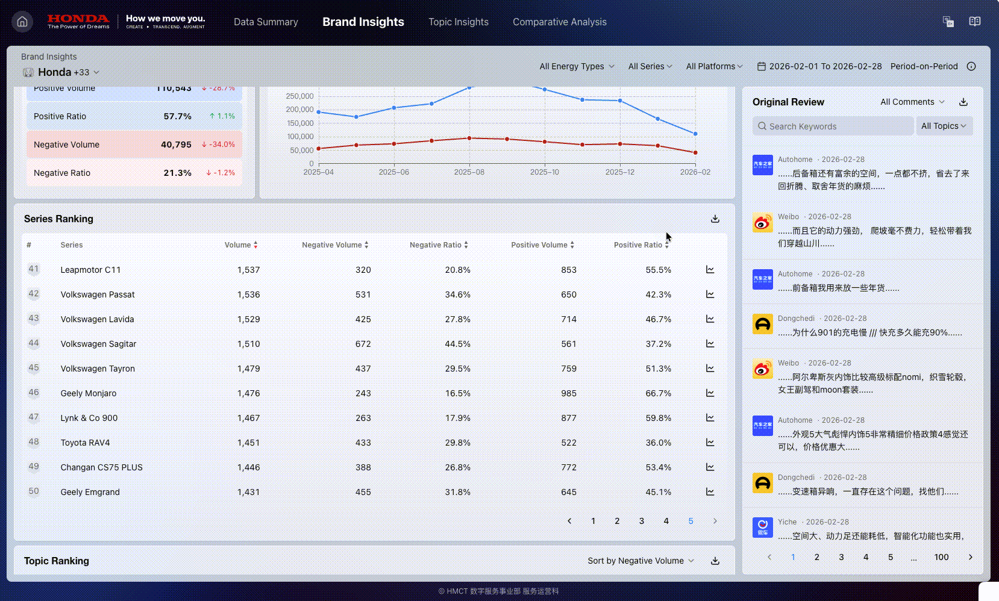
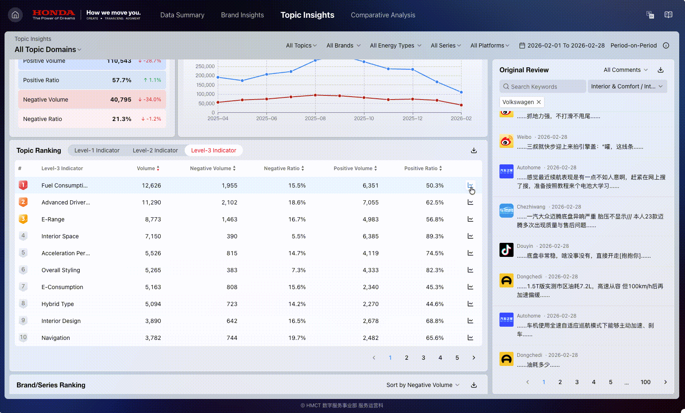

# CHINA CUSTOMER VOICE. User Manual

## CHINA CUSTOMER VOICE. User Manual

### Core Modules

* **Data Overview**：Monitor overall brand performance and trending topics
* **Brand Insights**：Explore brand and series performance across multiple dimensions
* **Topic Insights**：Identify user concerns and track emotional trends by topic
* **Comparative Analysis**：Conduct multi-dimensional comparisons to support business requirements
* **User Manual**：Access product features and usage instructions

<figure><figcaption></figcaption></figure>

***

### Data Overview

#### Use Cases

Provides a quick overview of each brand’s performance and discussion trends, offering insight into brand awareness and public sentiment.

#### Function Description

**Time Range Filtering**

* Click to select the date range for analysis.

<figure><figcaption></figcaption></figure>

* Click to set a comparison period for period-over-period, year-over-year, or custom time range analysis.

<figure><figcaption></figcaption></figure>

**Positive Ranking/Negative Ranking**

Click to switch between **Positive** and **Negative** Rankings, enabling users to view brand performance under different sentiment trends.

<figure><figcaption></figcaption></figure>

**Brand Switching**

Click the brand icon to switch to the selected brand and view related data in **Hot Topics**, **Trending Topics**, and **Topic Ranking**.

<figure><figcaption></figcaption></figure>

**Hot Topics**

Displays the most discussed topics, supports sorting by **positive** and **negative** volume.

<figure><figcaption></figcaption></figure>

**Trending Topics**

Displays topics with fast-growing discussion volumes recently, supports sorting by **positive** and **negative** growth rates.

<figure><figcaption></figcaption></figure>

**Topic Ranking**

Displays top topics in each sub-domain, supports sorting by **positive volume**, **positive ratio**, **negative volume**, and **negative ratio**.

<figure><figcaption></figcaption></figure>

***

### Brand Insights

#### Use Cases

In-depth analysis of overall brand performance among consumers, helping identify key strengths, notable features, and areas for improvement.

#### Filter Introduction

**Brand Filter**

Click to select one or more brands for analysis, supporting multiple selection, select all, or search.

<figure><figcaption></figcaption></figure>

**Energy Type Filter**

Click to filter data by energy type, supporting multiple selection, select all, or search.

<figure><figcaption></figcaption></figure>

**Series Filter**

Click to select specific series for analysis, supporting multiple selection, select all, or search.

<figure><figcaption></figcaption></figure>

**Platform Filter**

Click to filter data by platform, supporting multiple selection, select all, or search.

<figure><figcaption></figcaption></figure>

**Time Range Filter**

* Click to select the analysis period to view data performance.

<figure><figcaption></figcaption></figure>

* Click to select a comparison method, supporting **period-on-period**, **year-on-year**, or **custom time range** analysis.

<figure><figcaption></figcaption></figure>

#### Function Description

**Volume Overview**

Displays **the total volume**, **positive volume**, **positive ratio**, **negative volume**, **negative ratio**, and **the growth rates of each metric** for the selected brands and series in the current analysis period, providing a clear overview of overall brand performance.

<figure><figcaption></figcaption></figure>

**Volume Trends**

Displays the trend of **positive** and **negative volumes** for the selected brands and series over the past year, providing insight into long-term changes in brand and series reputation.

<figure><figcaption></figcaption></figure>

**Series Ranking**

* Displays the performance ranking of up to 50 series under selected brands, supporting sorting by **positive volume**, **positive ratio**, **negative volume**, and **negative ratio**.

<figure><figcaption></figcaption></figure>

* Click .png>) to view the detailed trend performance of the series over the past year.

<figure><figcaption></figcaption></figure>

* Cilck  to download data related to Series Ranking.
* Click on any series to update the **Customer Comments** module on the right, displaying comments related to that series.

<figure><figcaption></figcaption></figure>

**Topic Ranking**

* Displays the top topics in each sub-domain, supporting sorting by **positive volume**, **positive ratio**, **negative volume**, and **negative ratio**.

<figure><figcaption></figcaption></figure>

* Click .png>) to download data related to Topic Ranking.
* Click on any topic to update the **Customer Comments** module on the right, displaying comments related to that topic.

<figure><figcaption></figcaption></figure>

**Word Cloud**

* Displays popular discussion topics for selected brands and series, with word size automatically adjusted based on **total volume**, **positive volume**, or **negative volume**.
* Displays all data by default, with the option to filter and view only **positive** or **negative** content.

<figure><figcaption></figcaption></figure>

* Click .png>) to download data related to Word Cloud.
* Click on any word to update the **Customer Comments** module on the right, displaying comments related to that word.

<figure><figcaption></figcaption></figure>

**Customer Comments**

* Displays original posts and comments to capture authentic user feedback, supporting viewing of up to **2,000** comments.
* Click to search for relevant feedback and discussion topics using keywords.

<figure><figcaption></figcaption></figure>

* Click to filter customer comments by specific topics using the topic filter.

<figure><figcaption></figcaption></figure>

* Hover over the text to view the full content, and click .png>) to navigate to the original post.

<figure><figcaption></figcaption></figure>

* Click .png>) to download up to 50,000 Customer Comments.

***

### Topic Insights

#### Use Cases

In-depth analysis of user discussions from the topic perspective, offering insight into differences in focus across brands and identify consumers’ key needs, common pain points, and discussion trends.

#### Filter Introduction

**Topic Area Filter**

Click to select different topic areas for analysis; only single selection is supported.

<figure><figcaption></figcaption></figure>

**Topic Filter**

Click to select topics by different levels, supporting multiple selection, select all, and search.

<figure><figcaption></figcaption></figure>

**Brand Filter**

Click to select one or more brands for analysis, supporting multiple selection, select all, and search.

<figure><figcaption></figcaption></figure>

**Energy Type Filter**

Click to filter data by energy type, supporting multiple selection, select all, and search.

<figure><figcaption></figcaption></figure>

**Series Filter**

Click to select specific series to view product performance, supporting multiple selection, select all, and search.

<figure><figcaption></figcaption></figure>

**Platform Filter**

Click to filter data by platform, supporting multiple selection, select all, and search.

<figure><figcaption></figcaption></figure>

**Time Range Filter**

* Click to select the analysis period to view data performance.

<figure><figcaption></figcaption></figure>

* Click to select a comparison method, supporting **period-on-period**, **year-on-year**, or **custom time range** analysis.

<figure><figcaption></figcaption></figure>

#### Function Description

**Volume Overview**

Displays **the total volume**, **positive volume**, **positive ratio**, **negative volume**, **negative ratio**, and **the growth rates of each metric** for the selected topic in the current analysis period, providing a clear overview of topic performance.

<figure><figcaption></figcaption></figure>

**Volume Trends**

Displays the trend of **positive** and **negative volumes** for the selected topic over the past year, providing insight into long-term changes in topic popularity and sentiment.

<figure><figcaption></figcaption></figure>

**Topic Ranking**

* Displays topic rankings across different levels, supporting sorting by **positive volume**, **positive ratio**, **negative volume**, and **negative ratio**.

<figure><figcaption></figcaption></figure>

* Click to switch between topic levels and view topic performance at each level.

<figure><figcaption></figcaption></figure>

* Click .png>) to view the detailed trend performance of the topic over the past year.

<figure><figcaption></figcaption></figure>

* Click  to download data related to Topic Ranking.
* Click on any topic to update the **Customer Comments** module on the right, displaying comments related to that topic.

<figure><figcaption></figcaption></figure>

**Brand/Series Ranking**

* Displays the Top 10 brands and series within the selected topic area, supporting sorting by **positive volume**, **positive ratio**, **negative volume**, and **negative ratio**.

<figure><figcaption></figcaption></figure>

* Click .png>) to download data related to Brand/Series Ranking.
* Click on any brand or series to update the **Customer Comments** module on the right, displaying comments related to that brand or series.

<figure><figcaption></figcaption></figure>

**Word Cloud**

* Displays popular discussion topics for selected brands and series, with word size automatically adjusted according to **total volume**, **positive volume**, or **negative volume**.
* Displays all data by default, with the option to filter and view only **positive** or **negative** content.

<figure><figcaption></figcaption></figure>

* Click .png>) to download data related to Word Cloud.
* Click on any word to update the **Customer Comments** module on the right, displaying comments related to that word.

<figure><figcaption></figcaption></figure>

**Customer Comments**

* Displays original posts and comments to capture authentic user feedback, supporting viewing of up to **2,000** comments.
* Click to search for relevant feedback and discussion topics using keywords.

<figure><figcaption></figcaption></figure>

* Click to filter customer comments by specific topics using the topic filter.

<figure><figcaption></figcaption></figure>

* Hover over the text to view the full content, and click .png>) to navigate to the original post.

<figure><figcaption></figcaption></figure>

* Click .png>) to download up to 50,000 Customer Comments.

***

### Comparative Analysis

#### Use Cases

Allows users to select brands or series based on business requirements to perform a side-by-side comparison of the same topic, quickly understanding performance differences between objects and helping identify potential market opportunities.

#### Filter Introduction

**Ranking Filter**

Supports single-item ranking by **positive volume, negative volume, positive ratio, negative ratio, and total volume**.

<figure><figcaption></figcaption></figure>

**Topic Area Filter**

Supports selecting different topic areas for analysis; only single selection is supported.。

<figure><figcaption></figcaption></figure>

**Energy Type Filter**

Supports filtering data by energy type, with support for multiple selection, select all, and search.。

<figure><figcaption></figcaption></figure>

**Platform Filter**

Supports selecting data from different platforms, with support for multiple selection, select all, and search.。

<figure><figcaption></figcaption></figure>

**Time Range Filter**

*   Supports freely selecting the analysis period and viewing data performance across different time ranges.

    <figure><figcaption></figcaption></figure>
*   Supports multiple comparison methods, allowing users to perform period-on-period, year-on-year, or custom period analysis.

    <figure><figcaption></figcaption></figure>

#### Function Description

**Comparison Dimension Switch**

Provides two comparison dimensions: Brand and Series. Supports flexible switching between dimensions to analyze topic performance at different levels.

<figure><figcaption></figcaption></figure>

**Topic Configuration**

*   Click to select topics for inclusion in the comparison, with support for multiple selection, select all, and search.。

    <figure><figcaption></figcaption></figure>
*   Click to drill down to a lower level, and click to return to the previous level and view topic performance at different levels.

    <figure><figcaption></figcaption></figure>

**Topic Trends**

After selecting a topic, click to expand and view the changes in ranking topic for each brand over the past year, helping analyze long-term performance differences among brands for the same topic.

<figure><figcaption></figcaption></figure>

***

### Product Metrics

#### Metric Calculation Logic

**Statistical Metrics**

* Volume：The total number of mentions for a topic, including all sentences identified as positive, negative, or neutral.
* Negative Volume: The total number of sentences identified as negative in sentiment.
* Positive Volume: The total number of sentences identified as positive in sentiment.

**Proportion Metrics**

* Negative Ratio

$$
Negative Ratio = \frac{Negative Volume}{Total Volume}
$$

* Positive Ratio

$$
Positive Ratio = \frac{Positive Volume}{Total Volume}
$$

**Growth Metrics**

*   Growth Rate

    $$
    Growth Rate = \frac{Current Period Volume}{Comparison Period Volume} - 1
    $$
*   Negative Growth Rate

    $$
    Negative Growth Rate = \frac{Current Period Negative Volume}{Comparison Period Negative Volume} - 1
    $$
*   Positive Growth Rate

    $$
    Positive Growth Rate = \frac{Current Period Positive Volume}{Comparison Period Positive Volume} - 1
    $$
*   Negative Ratio Growth

    $$
    Negative Ratio Growth = Current Period Negative Ratio - Comparison Period Negative Ratio
    $$
*   Positive Ratio Growth

    $$
    Positive Ratio Growth = Current Period Positive Ratio - Comparison Period Positive Ratio
    $$

#### 数据对比逻辑

**Period-on-Period**

The comparison period is the time period right before the analysis period, with the same length.

> Sample
>
> * Analysis Time Range: 10 Nov 2024 – 20 Nov 2024
> * Comparison Time Range: 30 Oct 2024 – 9 Nov 2024

**Year-on-Year**

The comparison period is the same time range as the analysis period in the previous year.

> Sample
>
> * Analysis Time Range: 10 Nov 2024 – 20 Nov 2024
> * Comparison Time Range: 10 Nov 2024 – 20 Nov 2024

**Custom Time Range**

The comparison period can be selected by the user to support flexible and personalized data comparison.
